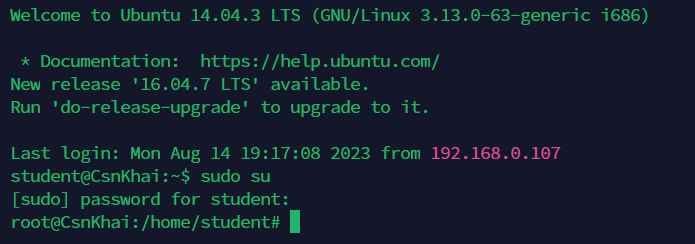

# Linux

## Task 1 - Part 1

1. **Log in to the system as root**.

    It's impossible to login into the system as root directly since `PermitRootLogin` is set to `without-password` which means that the `root` user can log in only using an SSH key pair, and not by entering a password directly.

    Proof:

    ```bash
    cat /etc/ssh/sshd_config | grep "PermitRootLogin"
    
    PermitRootLogin without-password
    ```
    And we have only the `student:123456` user:password pair, which means that it's the only way we have to login. So, let's connect via SSH as `student` and switch to root later on.

    

2. **Use the passwd command to change the password. Examine the basic parameters of the command. What system file does it change \*?**
    
    Let's change the password first.
    
    

    To examine the basic parameters of the command we could use `passwd -h`.

    

    When we change our password `passwd` modifies `/etc/shadow` file, where uor password is represented as SHA512 hash.

    You can see that the second column is different after we changed the password.

    

3. **Determine the users registered in the system, as well as what commands they execute. What additional information can be gleaned from the command execution?**

    We can use `cat /etc/passwd` to display all the existing users:

    

    This output provides the following information:
    
    

    To check the command history of the particular user, we could print out the contents of users `.bash_history`.

    

4. **Change personal information about yourself.**

    I've used `chfn` to change the personal information and `finger` to display it.

    

5. **Become familiar with the Linux help system and the man and info commands. Get help on the previously discussed commands, define and describe any two keys for these commands. Give examples.**

    Getting help in Linux involves utilizing various resources and commands to find useful information. The most useful commands are `man` and `info`.

    Most Linux commands come with built-in documentation known as man pages. One can access these pages by typing `man` followed by the command name. For example, type `man ls` to get information about the `ls` command.

    

    As you can see in the screenshot above, `ls` command has a lot of options with corresponding descriptions of them.

    Some commands have documentation in the Info format. This documentation can be accessed using the `info` command. For example: `info whoami` to access the documentation for the `whoami` command.

    


6. **Explore the more and less commands using the help system. View the contents of files .bash\* using commands.**

    The output of `man more` is provided below.

    

    The output of `man less` could be seen under this text, respectively.

    
    
    `less` allowed me to scroll through the text using both the mouse wheel and arrows.
    
    

7. **\* Describe in plans that you are working on laboratory work 1. Tip: You should read the documentation for the finger command.**

    According to the man pages on the `finger` command, to describe the plans, `.plan` file should exist.

    

    So, I created the following file, and the information appeared.

    

8. **\* List the contents of the home directory using the ls command, define its files and directories. Hint: Use the help system to familiarize yourself with the ls command.**

    As you can see, the output contains both files and directories (with a `d` prefix).

    


## Task 1 - Part 2

1. Examine the tree command. Master the technique of applying a template, for example, display all files that contain a character c, or files that contain a specific sequence of characters. List subdirectories of the root directory up to and including the second nesting level.


2. What command can be used to determine the type of file (for example, text or binary)? Give an example.


3. Master the skills of navigating the file system using relative and absolute paths. How can you go back to your home directory from anywhere in the filesystem?


4. Become familiar with the various options for the ls command. Give examples of listing directories using different keys. Explain the information displayed on the terminal using the -l and -a switches.


5. Perform the following sequence of operations: - create a subdirectory in the home directory; - in this subdirectory create a file containing information about directories located in the root directory (using I/O redirection operations);
- view the created file;
- copy the created file to your home directory using relative and absolute addressing.
- delete the previously created subdirectory with the file requesting removal;
- delete the file copied to the home directory.


6. Perform the following sequence of operations:
- create a subdirectory test in the home directory;
- copy the .bash_history file to this directory while changing its name to labwork2;
- create a hard and soft link to the labwork2 file in the test subdirectory;
- how to define soft and hard link, what do these
concepts;
- change the data by opening a symbolic link. What changes will happen and why
- rename the hard link file to hard_lnk_labwork2;
- rename the soft link file to symb_lnk_labwork2 file;
- then delete the labwork2. What changes have occurred and why?


7. Using the locate utility, find all files that contain the squid and traceroute sequence.


8. Determine which partitions are mounted in the system, as well as the types of these partitions.


9. Count the number of lines containing a given sequence of characters in a given file.


10. Using the find command, find all files in the /etc directory containing the host character sequence.


11. List all objects in /etc that contain the ss character sequence. How can I duplicate a similar command using a bunch of grep?


12. Organize a screen-by-screen print of the contents of the /etc directory. Hint: You must use stream redirection operations.


13. What are the types of devices and how to determine the type of device? Give examples.


14. How to determine the type of file in the system, what types of files are there?


15. * List the first 5 directory files that were recently accessed in the /etc directory.

