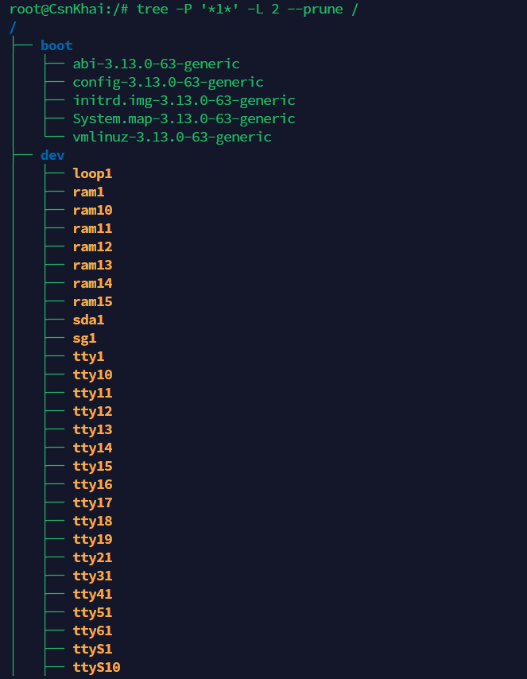

# Linux

## Task 1 - Part 1

1. **Log in to the system as root**.

    It's impossible to login into the system as root directly since `PermitRootLogin` is set to `without-password` which means that the `root` user can log in only using an SSH key pair, and not by entering a password directly.

    Proof:

    ```bash
    cat /etc/ssh/sshd_config | grep "PermitRootLogin"
    
    PermitRootLogin without-password
    ```
    And we have only the `student:123456` user:password pair, which means that it's the only way we have to login. So, let's connect via SSH as `student` and switch to root later on.

    

2. **Use the passwd command to change the password. Examine the basic parameters of the command. What system file does it change \*?**
    
    Let's change the password first.
    
    

    To examine the basic parameters of the command we could use `passwd -h`.

    

    When we change our password `passwd` modifies `/etc/shadow` file, where uor password is represented as SHA512 hash.

    You can see that the second column is different after we changed the password.

    

3. **Determine the users registered in the system, as well as what commands they execute. What additional information can be gleaned from the command execution?**

    We can use `cat /etc/passwd` to display all the existing users:

    

    This output provides the following information:
    
    

    To check the command history of the particular user, we could print out the contents of users `.bash_history`.

    

4. **Change personal information about yourself.**

    I've used `chfn` to change the personal information and `finger` to display it.

    

5. **Become familiar with the Linux help system and the man and info commands. Get help on the previously discussed commands, define and describe any two keys for these commands. Give examples.**

    Getting help in Linux involves utilizing various resources and commands to find useful information. The most useful commands are `man` and `info`.

    Most Linux commands come with built-in documentation known as man pages. One can access these pages by typing `man` followed by the command name. For example, type `man ls` to get information about the `ls` command.

    

    As you can see in the screenshot above, `ls` command has a lot of options with corresponding descriptions of them.

    Some commands have documentation in the Info format. This documentation can be accessed using the `info` command. For example: `info whoami` to access the documentation for the `whoami` command.

    


6. **Explore the more and less commands using the help system. View the contents of files .bash\* using commands.**

    The output of `man more` is provided below.

    

    The output of `man less` could be seen under this text, respectively.

    
    
    `less` allowed me to scroll through the text using both the mouse wheel and arrows.
    
    

7. **\* Describe in plans that you are working on laboratory work 1. Tip: You should read the documentation for the finger command.**

    According to the man pages on the `finger` command, to describe the plans, `.plan` file should exist.

    

    So, I created the following file, and the information appeared.

    

8. **\* List the contents of the home directory using the ls command, define its files and directories. Hint: Use the help system to familiarize yourself with the ls command.**

    As you can see, the output contains both files and directories (with a `d` prefix).

    


## Task 1 - Part 2

1. **Examine the tree command. Master the technique of applying a template, for example, display all files that contain a character c, or files that contain a specific sequence of characters. List subdirectories of the root directory up to and including the second nesting level.**

    The command below displays all the files that contain `1` and lists all the subdirectories up to and including the second nesting level.

    

2. **What command can be used to determine the type of file (for example, text or binary)? Give an example.**

    The `file` command is used to determine the type of the file.

    Usage:
    ```
    root@CsnKhai:~# file .profile
    .profile: ASCII text
    ```

3. **Master the skills of navigating the file system using relative and absolute paths. How can you go back to your home directory from anywhere in the filesystem?**

    To get back to the home directory from anywhere in the filesystem, the following command is used:

    ```bash
    cd ~
    ```

4. **Become familiar with the various options for the ls command. Give examples of listing directories using different keys. Explain the information displayed on the terminal using the -l and -a switches.**

    The `ls` command is used to list the contents of a directory. Here are some commonly used options:

    1. List files and directories using a long listing format:

        ```bash
        ls -l
        ```
    
    2. List files and directories, ignoring hidden entries starting with `.`:

        ```bash
        ls -a
        ```

    3. List all files in long format, including hidden ones:

        ```bash
        ls -la
        ```

    4. List files and directories in long format with human-readable file sizes:

        ```bash
        ls -lh
        ```

5. **Perform the following sequence of operations: - create a subdirectory in the home directory; - in this subdirectory create a file containing information about directories located in the root directory (using I/O redirection operations);**
- **view the created file;**
- **copy the created file to your home directory using relative and absolute addressing.**
- **delete the previously created subdirectory with the file requesting removal;**
- **delete the file copied to the home directory.**

    The solution is provided below:

    

6. **Perform the following sequence of operations:**
- **create a subdirectory test in the home directory;**
- **copy the .bash_history file to this directory while changing its name to labwork2;**
- **create a hard and soft link to the labwork2 file in the test subdirectory;**
- **how to define soft and hard link, what do these concepts;**
- **change the data by opening a symbolic link. What changes will happen and why**
- **rename the hard link file to hard_lnk_labwork2;**
- **rename the soft link file to symb_lnk_labwork2 file;**
- **then delete the labwork2. What changes have occurred and why?**

    The solving process is provided in the screenshot below.

    

    Up until this point we created hard and soft links to the file.

    Here is the difference between them:

    Hard Links:

    - A hard link is a direct reference to the inode (data structure that stores file attributes and disk block location) of a file.
    - All hard links to a file are essentially equal; there's no primary/original link.
    - Deleting one hard link does not affect the file or other hard links. The file's data remains until all hard links are removed.
    - Hard links cannot span across filesystems or partitions.
    - Hard links can only reference files, not directories.
    - Changing the data in any hard link directly affects the data in all other hard links since they point to the same inode.
    
    
    <br>Soft (Symbolic) Links: <br>
    - A soft link, also known as a symbolic link, is a separate file that contains a path to another file or directory.
    - Deleting the original file does not affect the symbolic link itself, but it renders the symbolic link broken (a "dangling" link).
    - Symbolic links can span filesystems and partitions.
    - Symbolic links can reference both files and directories.
    - If you delete the target file or directory, the symbolic link still points to it (though the link is broken).
    - Symbolic links can point to files or directories that do not exist.

    <br>After that, I used `nano` to open the link and changed some data:

    ```bash
    nano ~/test/my_soft_link
    ```

    The changes directly affected the target file `labwork2`, as both the symbolic link and the original file point to the same data.

    Then I renamed the files:

    ```bash
    student@CsnKhai:/$ mv ~/test/my_hard_link ~/test/hard_lnk_labwork2
    student@CsnKhai:/$ mv ~/test/my_soft_link ~/test/symb_lnk_labwork2_file
    student@CsnKhai:/$ rm ~/test/labwork2
    ```

    Renaming the hard link and soft link files didn't affect the actual content of the linked file, it only changed the link names.

    When I deleted the original file with `rm ~/test/labwork2`, the hard link `hard_lnk_labwork2` still referred to the data, so the data was not removed from the file system. However, when I deleted the original file, the symbolic link `symb_lnk_labwork2` became broken because it was pointing to a file that no longer existed.
    
7. **Using the locate utility, find all files that contain the squid and traceroute sequence.**

    ```bash
    student@CsnKhai:/$ locate squid traceroute
    /etc/alternatives/traceroute6
    /etc/alternatives/traceroute6.8.gz
    /lib/modules/3.13.0-63-generic/kernel/drivers/tty/n_tracerouter.ko
    /usr/bin/traceroute6
    /usr/bin/traceroute6.iputils
    /usr/share/man/man8/traceroute6.8.gz
    /usr/share/man/man8/traceroute6.iputils.8.gz
    /var/lib/dpkg/alternatives/traceroute6
    ```

8. **Determine which partitions are mounted in the system, as well as the types of these partitions.**

    ```bash
    student@CsnKhai:/$ df -hT
    Filesystem     Type      Size  Used Avail Use% Mounted on
    /dev/sda1      ext4      1.5G  929M  457M  68% /
    none           tmpfs     4.0K     0  4.0K   0% /sys/fs/cgroup
    udev           devtmpfs  112M  4.0K  112M   1% /dev
    tmpfs          tmpfs      25M  388K   24M   2% /run
    none           tmpfs     5.0M     0  5.0M   0% /run/lock
    none           tmpfs     121M     0  121M   0% /run/shm
    none           tmpfs     100M     0  100M   0% /run/user
    ```

9. **Count the number of lines containing a given sequence of characters in a given file.**

    ```bash
    student@CsnKhai:~$ grep -c "Lorem ipsum" test
    3
    
    student@CsnKhai:~$ cat test 
    Lorem ipsum dolor sit amet, 
    consectetur adipiscing elit, 
    sed tempor incididunt ut labore et dolore magna aliqua. 
    Lorem ipsum dolor sit amet
    Ut enim ad minim veniam, quis nostrud exercitation 
    ullamco laboris nisi ut aliquip ex ea commodo consequat. 
    Duis aute irure dolor reprehenderit voluptate 
    Lorem ipsum dolor sit amet
    velit esse cillum dolore eu fugiat nulla pariatur.
    ```

10. **Using the find command, find all files in the /etc directory containing the host character sequence.**

    ```bash
    student@CsnKhai:~$ sudo find /etc -type f -name "*host*"
    /etc/hosts
    /etc/hosts.allow
    /etc/ssh/ssh_host_ed25519_key.pub
    /etc/ssh/ssh_host_ecdsa_key.pub
    /etc/ssh/ssh_host_rsa_key
    /etc/ssh/ssh_host_rsa_key.pub
    /etc/ssh/ssh_host_ecdsa_key
    /etc/ssh/ssh_host_dsa_key.pub
    /etc/ssh/ssh_host_dsa_key
    /etc/ssh/ssh_host_ed25519_key
    /etc/init/hostname.conf
    /etc/hostname
    /etc/hosts.deny
    /etc/host.conf
    /etc/dbus-1/system.d/org.freedesktop.hostname1.conf
    ```

11. **List all objects in /etc that contain the ss character sequence. How can I duplicate a similar command using a bunch of grep?**

    The one way to do that without `grep`:

    ```bash
    student@CsnKhai:~$ find /etc -type f -name "*ss*"
    /etc/default/ssh
    /etc/default/nss
    /etc/ufw/applications.d/openssh-server
    /etc/issue.net
    ```

    The alternative way to achieve this is by using grep:

    ```bash
    ls /etc | grep "ss"
    ```

12. **Organize a screen-by-screen print of the contents of the /etc directory. Hint: You must use stream redirection operations.**

    ```bash
    ls /etc | less
    ```

13. **What are the types of devices and how to determine the type of device? Give examples.**

    Linux supports three types of hardware device: character, block and network.

    1. Block Devices:
        Block devices are used to store and retrieve data in fixed-size blocks. They include storage devices like hard drives and SSDs.

        To determine the type of block device, you can use the lsblk command or check the /sys/class/block directory.

        ```bash
        student@CsnKhai:~$ lsblk
        NAME   MAJ:MIN RM   SIZE RO TYPE MOUNTPOINT
        sda      8:0    0   1.5G  0 disk 
        └─sda1   8:1    0   1.5G  0 part /
        sr0     11:0    1  1024M  0 rom  
        ```

    2. Character Devices:
        Character devices are used to communicate with devices that transmit or receive data character by character, such as terminals, serial ports, and sound devices.

        To determine the type of character device, you can check the /sys/class/tty directory.

        ```bash
        student@CsnKhai:~$ ls -l /dev/tty*
        crw-rw-rw- 1 root    tty     5,  0 Aug 15 00:19 /dev/tty
        crw--w---- 1 root    tty     4,  0 Aug 14 18:46 /dev/tty0
        crw------- 1 student tty     4,  1 Aug 14 18:47 /dev/tty1
        ```

    3. Network Devices:
        Network devices, also known as network interfaces, are used to connect to networks, such as Ethernet or wireless connections.

        To determine the network devices, you can use the ifconfig or ip commands.

        Example:

        ```bash
        student@CsnKhai:~$ ifconfig -a
        lo        Link encap:Local Loopback  
                inet addr:127.0.0.1  Mask:255.0.0.0
                inet6 addr: ::1/128 Scope:Host
                UP LOOPBACK RUNNING  MTU:65536  Metric:1
                RX packets:16 errors:0 dropped:0 overruns:0 frame:0
                TX packets:16 errors:0 dropped:0 overruns:0 carrier:0
                collisions:0 txqueuelen:0 
                RX bytes:1184 (1.1 KB)  TX bytes:1184 (1.1 KB) 
        ```


14. **How to determine the type of file in the system, what types of files are there?**

    To determine the file type, `file` command should be used. 

    Usage:
    
    ```bash
    student@CsnKhai:~$ file myfile.txt 
    myfile.txt: ASCII text
    ```

    Among the common file types are: regular files, directories, symbolic links, binary files, text files, image files, audio/video files, etc.

15. **\* List the first 5 directory files that were recently accessed in the /etc directory.**

    ```
    student@CsnKhai:~$ ls -lt --time=atime /etc | head -n 6
    total 732
    -rw-r----- 1 root shadow   559 Aug 15 00:19 gshadow
    -rw------- 1 root root     619 Aug 15 00:19 shadow-
    -rw------- 1 root root       0 Aug 15 00:19 subgid-
    -rw-r----- 1 root fuse     280 Aug 15 00:19 fuse.conf
    -rw------- 1 root root     658 Aug 15 00:19 group-
    ```

