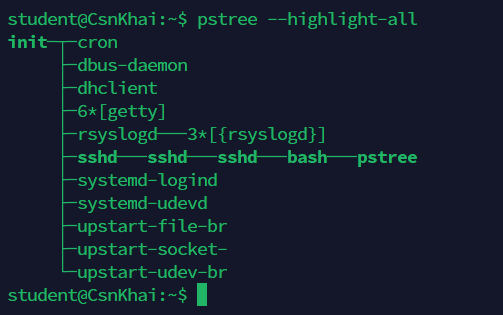
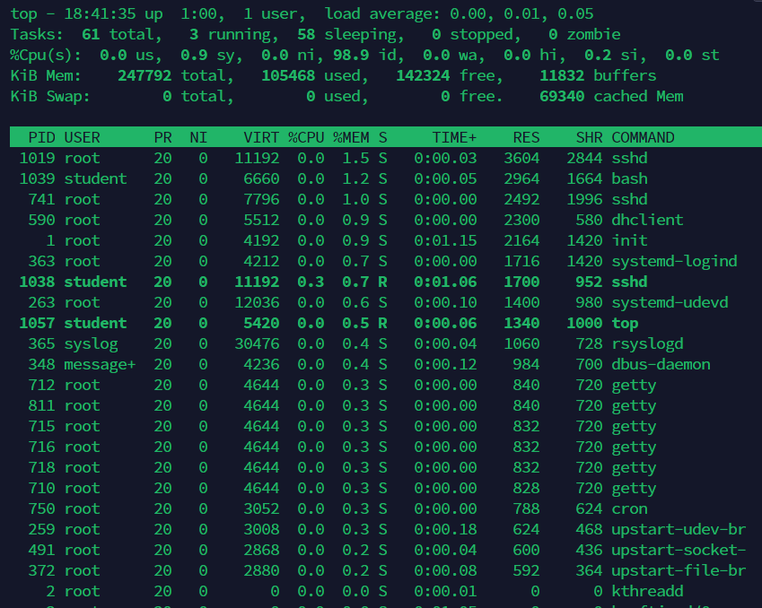

# Linux

## Task 3 - Part 1

1. **How many states could has a process in Linux?**

    The number of states a process can have in Linux is generally considered to be five: Running, Sleeping, Waiting, Stopped, and Zombie.

2. **Examine the pstree command. Make output (highlight) the chain (ancestors) of the current process.**

    

3. **What is a proc file system?**

    The `/proc` filesystem in Linux is a virtual filesystem that provides information about running processes and system resources. It allows direct access to kernel data structures.

4. **Print information about the processor (its type, supported technologies, etc.).**

    ```
    student@CsnKhai:~$ lscpu
    Architecture:          i686
    CPU op-mode(s):        32-bit
    Byte Order:            Little Endian
    CPU(s):                1
    On-line CPU(s) list:   0
    Thread(s) per core:    1
    Core(s) per socket:    1
    Socket(s):             1
    Vendor ID:             AuthenticAMD
    CPU family:            23
    Model:                 24
    Stepping:              1
    CPU MHz:               0.000
    BogoMIPS:              12320.76
    L1d cache:             32K
    L1i cache:             64K
    L2 cache:              512K
    L3 cache:              4096K
    ```

5. **Use the ps command to get information about the process. The information should be as follows: the owner of the process, the arguments with which the process was launched for execution, the group owner of this process, etc.**

    ```bash
    student@CsnKhai:~$ ps -o user,args,group,pid,ppid,tty,cmd
    USER     COMMAND                     GROUP      PID  PPID TT       CMD
    student  -bash                       student    833   832 pts/0    -bash
    student  ps -o user,args,group,pid,p student    873   833 pts/0    ps -o user,args,group,pid,ppid,tty,cmd
    ```

6. **How to define kernel processes and user processes?**

    To define the difference between kernel and user processes, we simply need to execute `ps` and check the PID.

    Kernel processes are managed by the kernel itself and have a PID less than 1000. User processes have higher PID values and are managed by users or applications.

7. **Print the list of processes to the terminal. Briefly describe the statuses of the processes. What condition are they in, or can they be arriving in?**

    Here is a list of the first 10 processes:

    ```
    student@CsnKhai:~$ ps aux | head
    USER       PID %CPU %MEM    VSZ   RSS TTY      STAT START   TIME COMMAND
    root         1  0.0  0.8   4192  2164 ?        Ss   17:40   0:01 /sbin/init
    root         2  0.0  0.0      0     0 ?        S    17:40   0:00 [kthreadd]
    root         3  0.0  0.0      0     0 ?        S    17:40   0:00 [ksoftirqd/0]
    root         4  0.0  0.0      0     0 ?        S    17:40   0:00 [kworker/0:0]
    root         5  0.0  0.0      0     0 ?        S<   17:40   0:00 [kworker/0:0H]
    root         7  0.0  0.0      0     0 ?        S    17:40   0:00 [rcu_sched]
    root         8  0.0  0.0      0     0 ?        S    17:40   0:00 [rcu_bh]
    root         9  0.0  0.0      0     0 ?        S    17:40   0:00 [migration/0]
    root        10  0.0  0.0      0     0 ?        S    17:40   0:00 [watchdog/0]
    ```

    Most of the processes are in the `S` or `Sleeping` state. It means that the process is waiting for some event to complete. It may wake up when an event it's waiting for occurs.

    There is one process in `Ss` state, which means that the process is a session leader with a controlling terminal. 
    And `S<` state, which indicates that the process has high-priority.

    There are also a few other states:

    

8. **Display only the processes of a specific user.** 

    Let's display the processes of the current user.

    ```bash
    student@CsnKhai:~$ ps -u student
    PID TTY          TIME CMD
    840 ?        00:00:00 sshd
    841 pts/0    00:00:00 bash
    865 pts/0    00:00:00 ps
    ```

9. **What utilities can be used to analyze existing running tasks (by analyzing the help for the ps command)?**

    According to the man page of `ps` command, there are various ways of analyzing existing running tasks. Here are some of the examples:

    ```bash
    EXAMPLES
       To see every process on the system using standard syntax:
          ps -e
          ps -ef
          ps -eF
          ps -ely

       To see every process on the system using BSD syntax:
          ps ax
          ps axu

       To print a process tree:
          ps -ejH
          ps axjf

       To get info about threads:
          ps -eLf
          ps axms

       To get security info:
          ps -eo euser,ruser,suser,fuser,f,comm,label
          ps axZ
          ps -eM

       To see every process running as root (real & effective ID) in user format:
          ps -U root -u root u
    ```

10. **What information does top command display?**

    The `top` command displays real-time information about system processes, including CPU, memory, and more.

    

11. **Display the processes of the specific user using the top command.**

    To display the processes of a specific user using the top command, the following syntax should be used:

    ```bash
    top -u student
    ```

    Result:

    

12. **What interactive commands can be used to control the top command? Give a couple of examples.**

    Interactive commands to control top include:

    - k: Kill a process
    - r: Renice a process
    - z: Toggle color/mono
    - q: Quit

13. **Sort the contents of the processes window using various parameters (for example, the amount of processor time taken up, etc.)**

    I've sorted processes by memory using the `Shift+F` menu:

    


14. **Concept of priority, what commands are used to set priority?**

    Priority refers to the importance of a process. The `nice` and `renices` commands can be used to set priority.

15. **Can I change the priority of a process using the top command? If so, how?**

    Yes, it's possible to change a process's priority in `top` by pressing `r`, entering the PID, and setting the new priority.

16. **Examine the kill command. How to send with the kill command process control signal? Give an example of commonly used signals.**

    The `kill` command can be used to terminate, stop, or modify the behavior of processes by sending different signals.

    To use the `kill` command to send a signal to a process, we need to provide the process ID (PID) of the target process and the signal number or name. The basic syntax is:

    ```bash
    kill [options] SIGNAL PID
    ```

    Among the most popular signals are:

    - SIGTERM (15): This is the default signal sent by kill. It asks the process to terminate gracefully, allowing it to perform cleanup operations before exiting.
    - SIGKILL (9): This signal forcefully terminates the process. It cannot be caught or ignored by the process and should be used with caution.
    - SIGHUP (1): This signal is often used to instruct a process to reload its configuration or restart.
    - SIGINT (2): This signal is sent when the user presses Ctrl+C in the terminal. It's commonly used to interrupt a process.
    - SIGSTOP (19): This signal stops (pauses) a process. It can be resumed later using the SIGCONT signal.

    <br>

17. **Commands jobs, fg, bg, nohup. What are they for? Use the sleep, yes command to demonstrate the process control mechanism with fg, bg.**

    `sleep` command is used to cause a delay for a specified amount of time.

    `yes` command might be useful if you need a continuous stream of output.

    In the example below, I've used `jobs` command to list all the jobs (processes in the current terminal session). It displays a list of these jobs along with their status and job numbers. 

    `bg` command was used to send a suspended (stopped) process to the background, allowing it to continue running without blocking the terminal.

    `fg` command was used to bring a background process to the foreground, making it an active process and allowing it to interact with the terminal.

    ```
    student@CsnKhai:~$ jobs
    [1]+  Stopped                 yes
    [2]   Running                 sleep 300 &
    [3]-  Running                 sleep 600 &
    student@CsnKhai:~$ fg %2
    sleep 300
    ^Z
    [2]+  Stopped                 sleep 300
    student@CsnKhai:~$ jobs
    [1]-  Stopped                 yes
    [2]+  Stopped                 sleep 300
    [3]   Running                 sleep 600 &
    student@CsnKhai:~$ bg %2
    [2]+ sleep 300 &
    student@CsnKhai:~$ jobs
    [1]+  Stopped                 yes
    [2]   Running                 sleep 300 &
    [3]-  Running                 sleep 600 &
    ```

    But the problem is, that there is a chance (not always, as my experiments with `sleep`showed), that the processes would stop running after disconnecting. So, if we want to keep the process running after disconnecting, `nohup` should be used.

    Usage:

    ```bash
    nohup command-name &
    ```

## Task 3 - Part 2

1. **Check the implementability of the most frequently used OPENSSH commands in the MS Windows operating system. (Description of the expected result of the commands + screenshots: command – result should be presented)**


2. **Implement basic SSH settings to increase the security of the client-server connection.**


3. **List the options for choosing keys for encryption in SSH. Implement 3 of them.**


4. **Implement port forwarding for the SSH client from the host machine to the guest Linux virtual machine behind NAT.**


5\*. **Intercept (capture) traffic (tcpdump, wireshark) while authorizing the remote client on the server using ssh, telnet, rlogin. Analyze the result.**