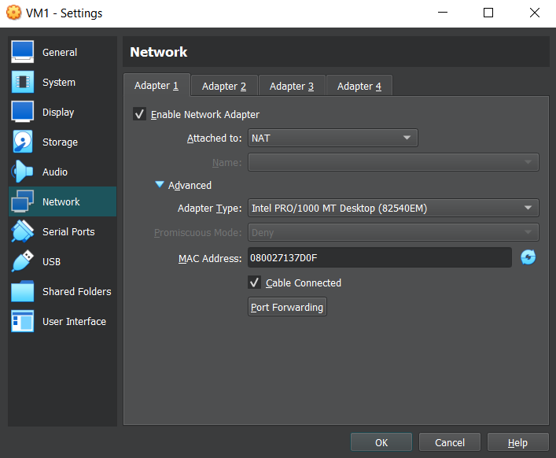
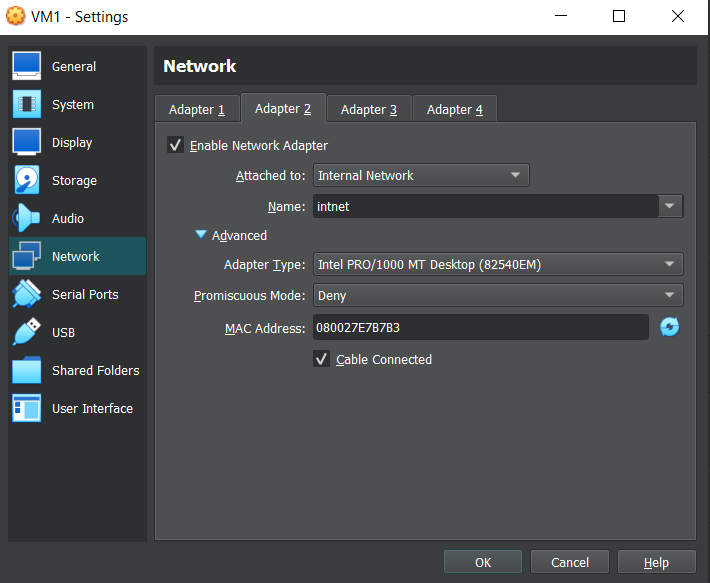
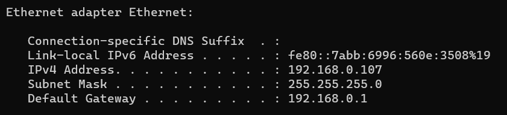

# Networking

## Task 1 - IP routing

1. **Create virtual machines connection according to figure 1:**

    

    VM1 network settings: 

    
    

    VM2 network settings:

    

2. **VM2 has one interface (internal), VM1 has 2 interfaces (NAT and internal). Configure all network interfaces in order to make VM2 has an access to the Internet (iptables, forward, masquerade).**

    Firstly, I modified `/etc/sysctl.conf` for VM1:

    

    And applied the changes:

    

    After that, I added a few rules to `iptables`:

    

    And used the following commands to make the changes persistent:

    ```
    sudo apt-get install iptables-persistent
    sudo service iptables-persistent start
    ```

    Then, I edited `/etc/network/interfaces` on both of my VMs:

    
    

    And rebooted network interfaces with the following commands:

    ```
    sudo ifdown -a
    sudo ifup -a
    ```

    Lastly, I added dns-nameservers to `/etc/network/interfaces`:

    ```
    dns-nameservers 8.8.8.8 8.8.4.4
    ```

3. **Check the route from VM2 to Host.**

    

4. **Check the access to the Internet, (just ping, for example, 8.8.8.8).**

    

5. **Determine, which resource has an IP address 8.8.8.8.**

    

6. **Determine, which IP address belongs to resource epam.com.**

    

7. **Determine the default gateway for your HOST and display routing table.**

    The default gateway of my host is `192.168.0.1`.

    

8. **Trace the route to google.com.**

    `mtr google.com` output:

    