# Networking

## Task 2 - Configuring DHCP, DNS servers and dynamic routing using OSPF protocol

1. **Use already created internal-network for three VMs (VM1-VM3). VM1 has NAT and internal, VM2, VM3 – internal only interfaces.**

    VM1: 

    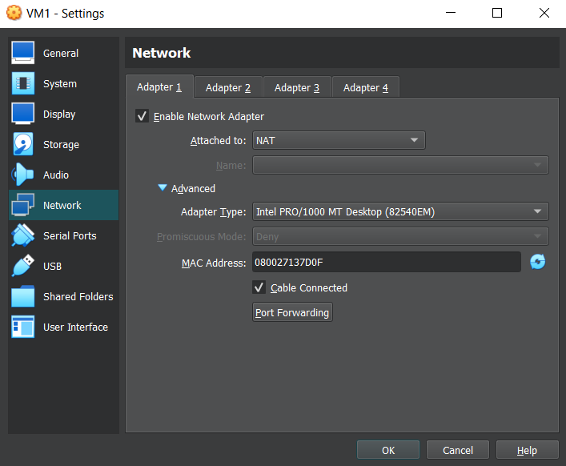
    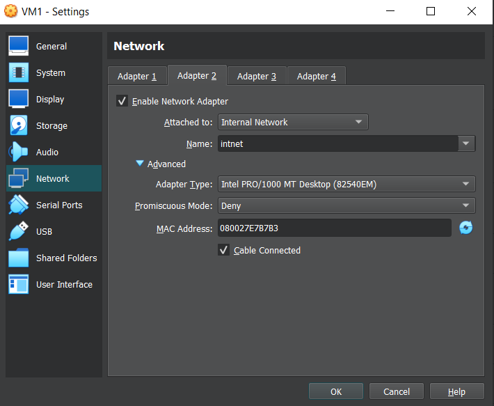

    VM2: 

    

    VM3:

    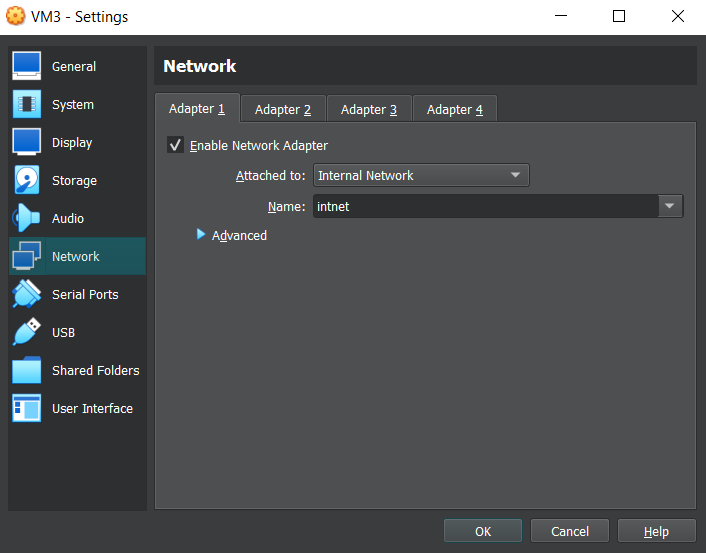

2. **Install and configure DHCP server on VM1. (3 ways: using VBoxManage, DNSMASQ and ISC-DHSPSERVER). You should use at least 2 of them.**

    ### VBoxManage

    Firstly, I created DHCP server using VBoxManage:

    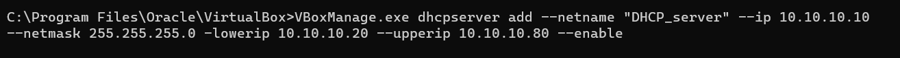

    After that, I specified the chosen name in the network tab for all the machines.

    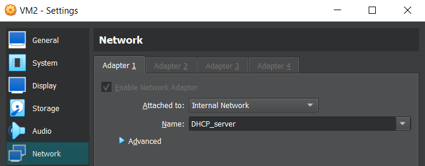

    And I also made sure to change the `/etc/network/interafces` config to enable DHCP since we used static IPs in the previous task.

    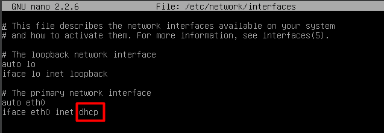

    ### DNSMASQ

    Firstly, I installed DNSMASQ on VM1:

    ```
    sudo apt update
    sudo apt install dnsmasq
    ```


    Then I edited the network interface for this VM:


    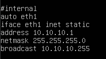


    And configured the `/etc/dnsmasq.conf` file:


    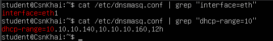


    After that, restart the service with the following command:
       
    ```
    sudo service dnsmasq restart
    ```


    Also, I made sure to change the network back to `intnet`, to avoid using the DHCP server that we created in the previous step.


    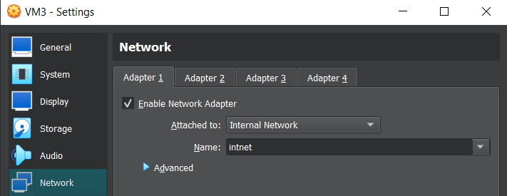


    No further actions were needed; the results are provided in the next step.


3. **Check VM2 and VM3 for obtaining network addresses from DHCP server.**

    ### VboxManage

    All the machines obtained the correct addresses.

    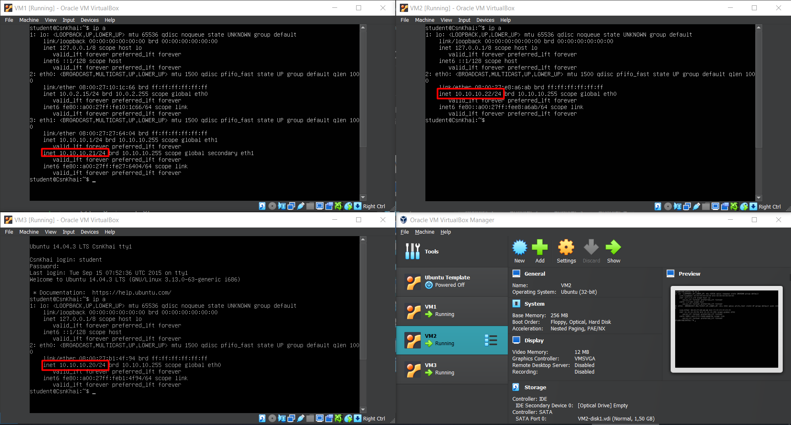

    ### DNSMASQ

    DNSMASQ also provided the correct IPs with no problems.

    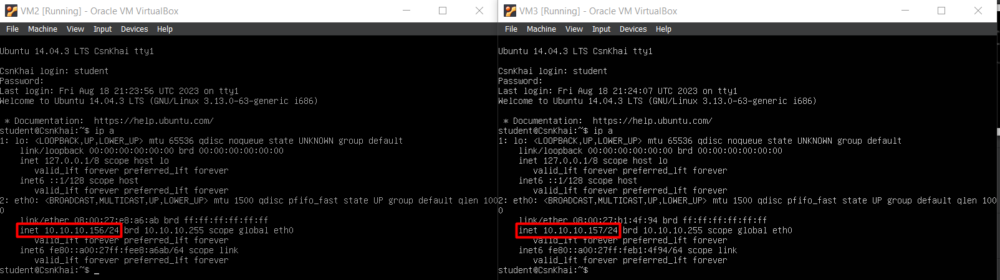


4. **Using existed network for three VMs (from p.1) install and configure DNS server on VM1. (You can use DNSMASQ, BIND9 or something else).**

    Since forwarding on VM1 was already implemented in Task 1, and DNSMASQ was configured in the previous step, nothing else was left to set up. The DNS server on both VM2 and VM3 was configured along with the DHCP.

5. **Check VM2 and VM3 for gaining access to DNS server (naming services).**

    As you can see in the screenshot below, VM1 uses a local DNS server (`127.0.0.1#53`), and both VM2 and VM3 use VM1 as their DNS (`10.10.10.1#53`).

    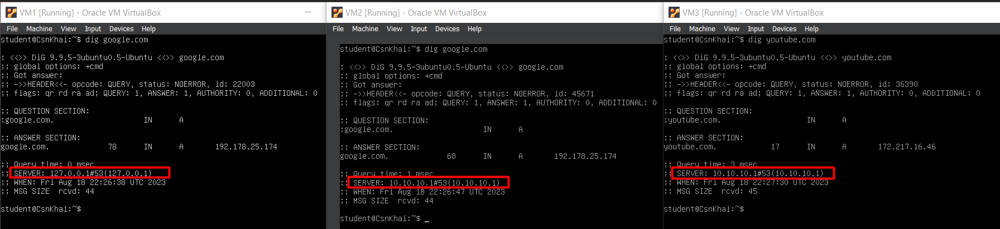