# Networking

## DNS

1. **Register free domain (…pp.ua) https://nic.ua/en/domains**

    Firstly, I registered a new domain:

    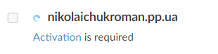

2. **Activate created domain**

    After that, I activated it:

    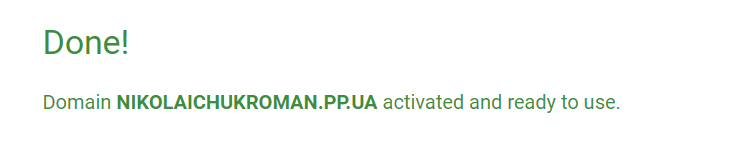

3. **Register new AWS Account https://portal.aws.amazon.com/billing/signup#/start/email**

    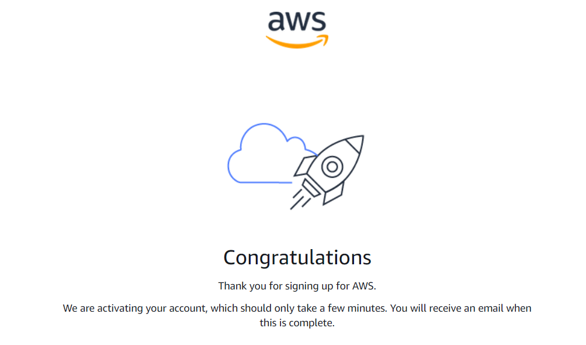

4. **Create Hosted Zone in Route 53 (name of hosted zone should the name of registered domain on https://nic.ua/en/domains).**

    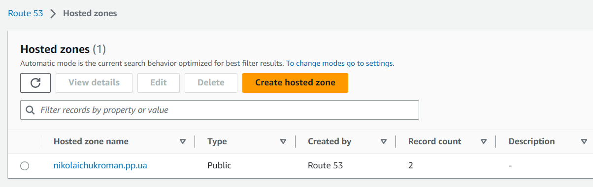

5. **Copy NS records in hosted zone and Change NS-servers setting to ‘Custom name server’ on nic.ua and paste copied NS records**

    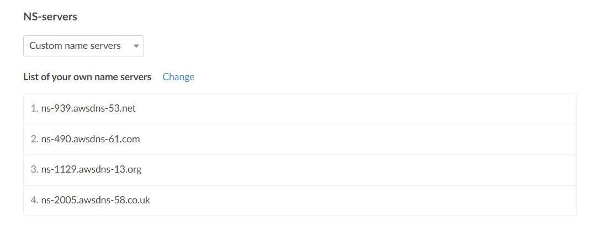

6. **Check NS records of your domain using dig or nslookup commands (you should see NS records from hosted zone)**

    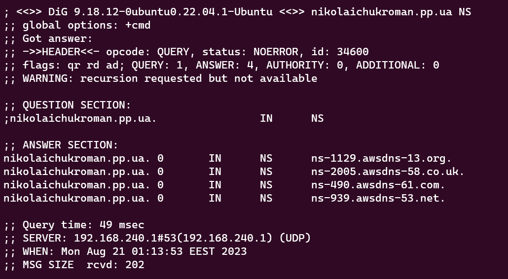

7. **Create A and CNAME records in hosted zone.**

    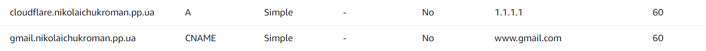

8. **\*Set latency routing policy for two DNS records.**

    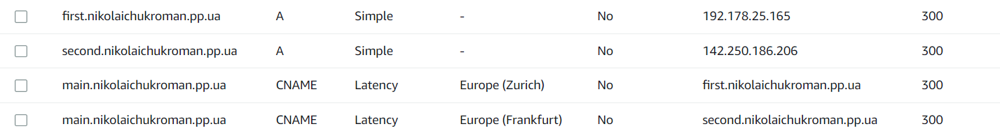

9. **\*Check created dns records using dig or nslookup commands.**

    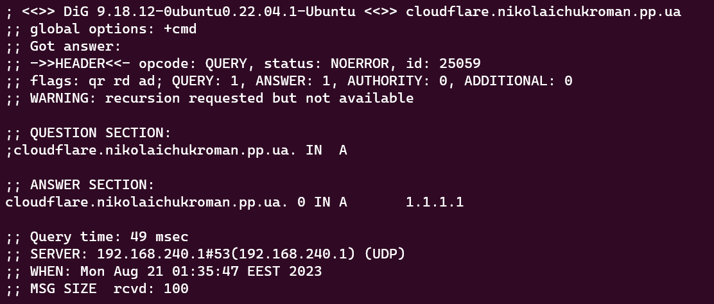
    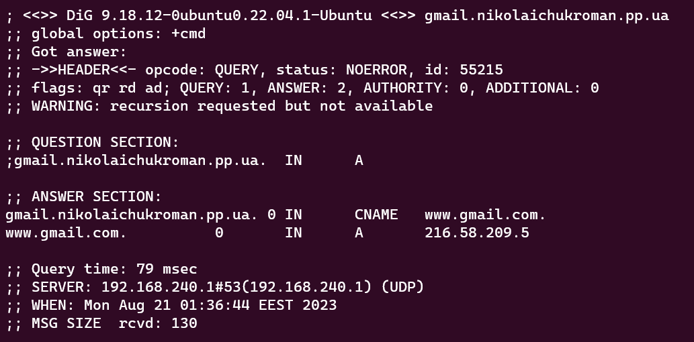
    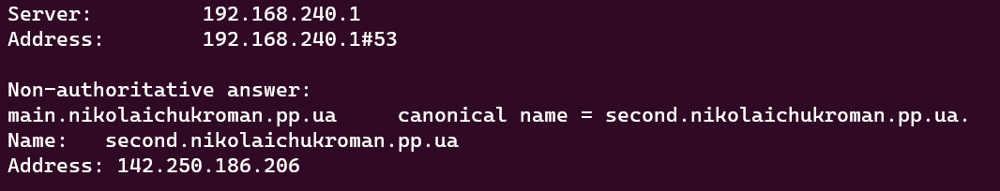