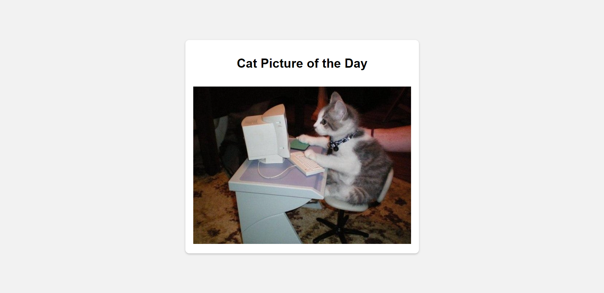

# Docker

## Create a Docker image with the Python Flask app that displays random cat pictures.

Firstly, I created an app:

```python
from flask import Flask, render_template
import random

app = Flask(__name__)


cat_images = [
    "https://cdn2.thecatapi.com/images/wJyw82pIl.jpg",
    "https://cdn2.thecatapi.com/images/duo.jpg",
    "https://cdn2.thecatapi.com/images/biu.png",
    "https://cdn2.thecatapi.com/images/56i.jpg",
    "https://cdn2.thecatapi.com/images/P4xLtrwmc.jpg"
]

@app.route('/')
def index():
    random_cat_image = random.choice(cat_images)
    return render_template('index.html', cat_image=random_cat_image)

if __name__ == '__main__':
    app.run(debug=True, host='0.0.0.0')

```

After that, I wrote a `Dockerfile`:

```dockerfile
FROM python:3.9-alpine

COPY ./cat-app /cat-app

RUN pip install Flask

CMD [ "python", "/cat-app/app.py" ]

EXPOSE 5000
```

After that, I built the image with the following command:

```
docker build -t cat-app .
```

It appeared in the image list:

```
REPOSITORY   TAG       IMAGE ID       CREATED          SIZE
cat-app      latest    c28afdbcf562   38 minutes ago   59.3MB
```

And after that, I launched the container:

```
docker run -d -p 5000:5000 cat-app
```

As a result, my marvelous app was running at `localhost:5000`:

