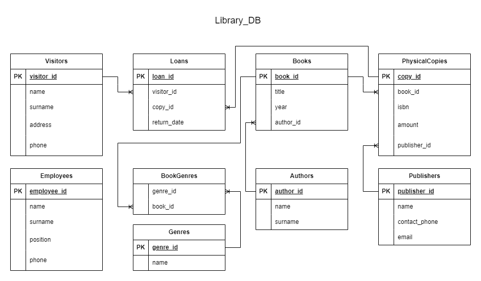

# Library Database Design and Implementation

## Database Design

The database design process involved creating an entity-relationship diagram (ERD) using draw.io. The ERD outlines the different entities, their attributes, and the relationships between them within the library database. 

## Database Implementation

The database design was translated into a SQL script for PostgreSQL, which could be found in the `script.sql` file. This script includes both table creation and any necessary constraints to ensure data integrity. It also provides some dummy data insertion.
